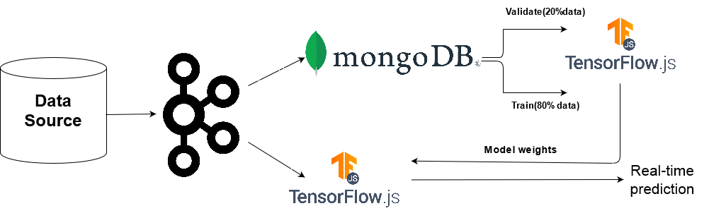
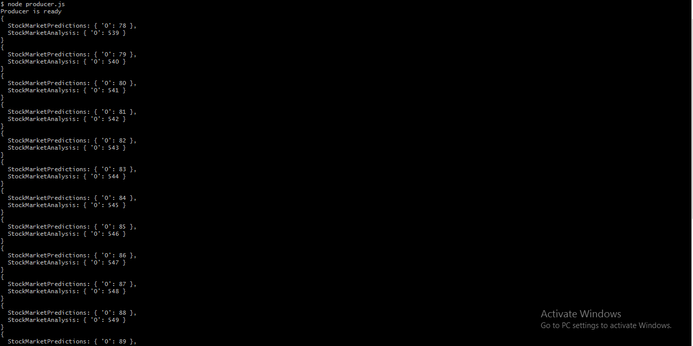
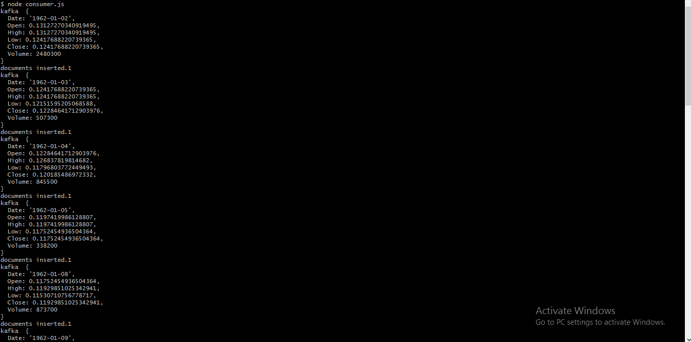
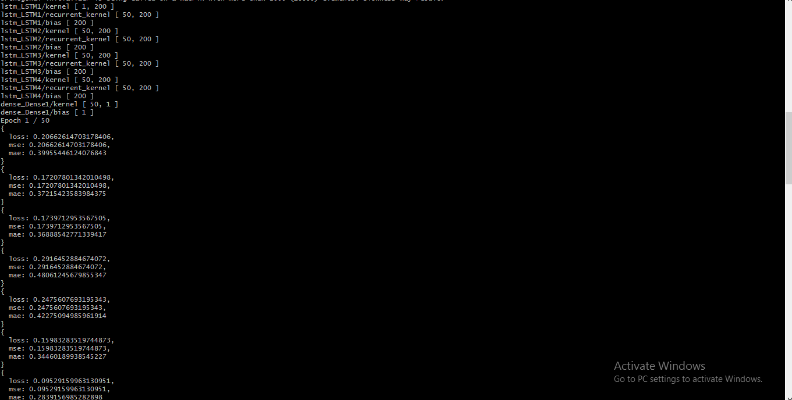
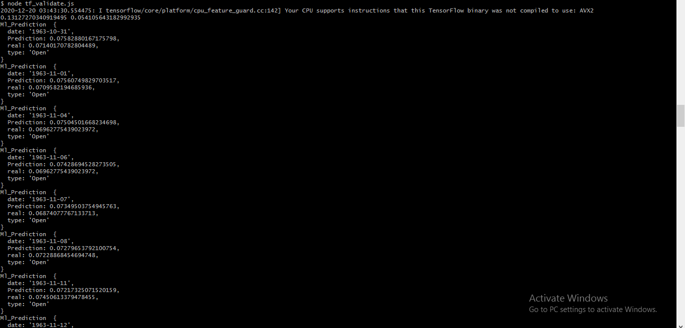
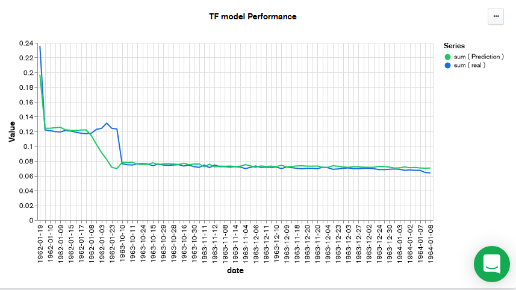
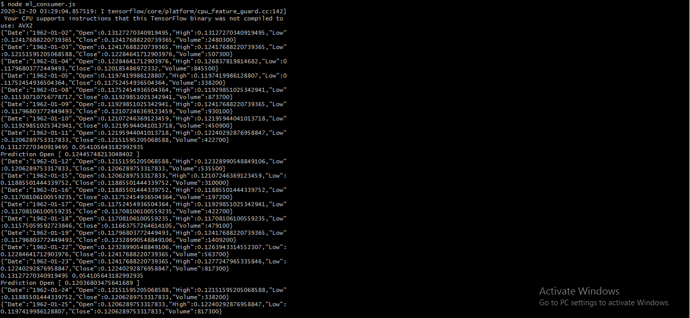

<center><h1>&nbsp;&nbsp;&nbsp;&nbsp;&nbsp;&nbsp;&nbsp;&nbsp;&nbsp;&nbsp;&nbsp;&nbsp;&nbsp;&nbsp;&nbsp;&nbsp;&nbsp;&nbsp;&nbsp;⏱️ Real Time Machine Learning 🤖</h1></center>


<center><p>Welcome to my real-time stock market prediction with Machine Learning project. I have used TensorFlow.js for constructing ml model architecture, and Kafka for real-time data streaming and pipelining.</p></center>

## Architecture


## Technologies used:
 1. Kafka.<br>
    - Pipelining logs from source to topics.
    - Topics are subscribed by consumer for real-time ml prediction and model training in parallel.
 2. TensorFlow.js.<br>
    - Construction of tensorflow model in node.js.
    - Training model with time-series stock market data.
    - Use tfjs model for real-time prediction.
 3. MongoDB.<br>
    - Update data-base with incoming stock market logs.
    - Use stored logs for analysis, and model training.
    - Store performance of the ml model for monitoring purpose.
 4. Node.js <br>
    - The entire server architecture is developed with node.js

## Implementation

### Start the Kafka environment
Start the ZooKeeper service.
```sh
$ bin/zookeeper-server-start.sh config/zookeeper.properties
```
Start the Kafka broker service
```sh
$ bin/kafka-server-start.sh config/server.properties
```

### Start Streaming of logs.

Here, I have used .csv files in the dataset folder as the source of data. The data-source is pipelined with Kafka Topics. The first topic pipelines logs to MongoDB and the second topic pipelines logs to Tensorflow model for real-time prediction.<br>
The streaming of logs from data-source through producer and consumer makes this architecture suitable for real-time analysis, ML model training and model prediction in parallel.<br>
The producer could be started from
```sh
$ node producer.js
# or
$ start.sh
```
Streaming producer logs.<br>

<br>
```sh
$ node consumer.js
```
Streaming consumer logs.<br>

<br>
In the __consumer__(consumer.js) the incoming logs are updated to MongoDB for further model training and analysis.

### Machine Learning model.

The machine learning model architecture has been developed with TensorFlow.js. The model is trained with 80% of the stored data and validated against 20% of them. As the problem statement focuses over a time-series problem so we need to pre-process the data before training. Data have been pre-processed with **MinMax-Scalar** algorithm.<br>
Training the ml model.
```sh
$ node tf_train.js
# or
$ server.sh
```

Validating the model.

```sh
$ node tf_validate.js
```

<br>
After validation the real and predicted values along with date and attribute of the stock-market time-series data that the model is trained against are updated to the MongoDB.<br>
### Model performance chart from MongoDB


### Real-time prediction.
The weights of the trained model are saved and loaded at the consumer side that subscribes to the second topic of the Kafka stream and predicts the output of the time-series event in real-time. As both topics of the Kafka pipeline are working in parallel, parallelism is achieved and logs are streamed by Kafka is real-time, which indeed implies the machine learning model could train and predict target in real-time.
```sh
$ node ml_consumer.js
```


```
Prediction [attribute] [predicted value].
example - Prediction Open 0.12453 
```
This line in the above image(ml_consumer.js output) indicates the prediction of the model in real-time. The model utilizes 7 prior time-series logs as input and predicts the 8th time-series event. 

